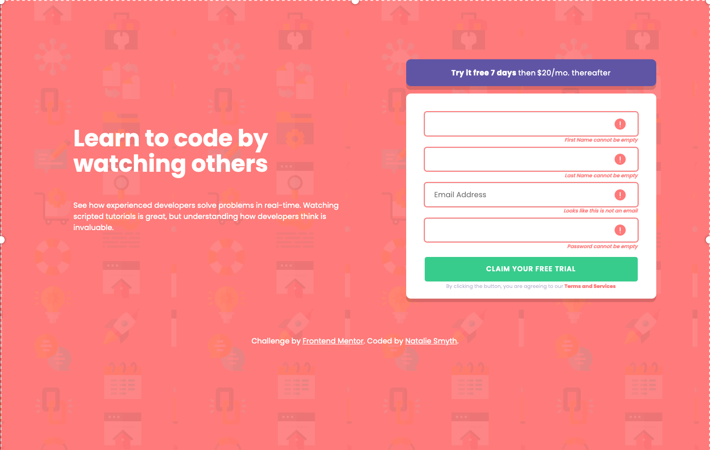

# Frontend Mentor - Intro component with sign up form solution

This is a solution to the [Intro component with sign up form challenge on Frontend Mentor](https://www.frontendmentor.io/challenges/intro-component-with-signup-form-5cf91bd49edda32581d28fd1). Frontend Mentor challenges help you improve your coding skills by building realistic projects.

## Table of contents

- [Overview](#overview)
  - [The challenge](#the-challenge)
  - [Screenshot](#screenshot)
  - [Links](#links)
- [My process](#my-process)
  - [Built with](#built-with)
  - [Continued development](#continued-development)
  - [Useful resources](#useful-resources)
- [Author](#author)
- [Acknowledgments](#acknowledgments)

## Overview

### The challenge

Users should be able to:

- View the optimal layout for the site depending on their device's screen size
- See hover states for all interactive elements on the page
- Receive an error message when the `form` is submitted if:
  - Any `input` field is empty. The message for this error should say *"[Field Name] cannot be empty"*
  - The email address is not formatted correctly (i.e. a correct email address should have this structure: `name@host.tld`). The message for this error should say *"Looks like this is not an email"*

### Screenshot

### Links

- Solution URL: [https://github.com/nataliesmyth/FEM-intro-component-signup-form](Solution Code)
- Live Site URL: [https://nataliesmyth.github.io/FEM-intro-component-signup-form/](Live Site)

## My process

### Built with

- Semantic HTML5 markup
- CSS custom properties
- Flexbox
- CSS Grid
- Mobile-first workflow

### Continued development

Building this project highlighted my weaknesses in web development. I knew my understanding of forms could use some work, but the pains of getting this project to look and work the way I wanted to drove home that I need to spend more time focusing on forms, inputs, and how they function within the DOM and JavaScript.

### Useful resources

- [MDN Web Docs](https://developer.mozilla.org/en-US/docs/Web/HTML/Element/Input#placeholder) - As with pretty much everything related to web development, Mozilla docs were instrumental in completing this project.

## Author

- Website - [Natalie Smyth](https://www.nataliesmyth.com)
- Frontend Mentor - [@nataliesmyth](https://www.frontendmentor.io/profile/nataliesmyth)
- Twitter - [@itsbirdyperch](https://www.twitter.com/itsbirdyperch)

## Acknowledgments

- Thank you [Andy Bell](https://www.andy-bell.co.uk) for [A (more) Modern CSS Reset](https://andy-bell.co.uk/a-more-modern-css-reset/)
